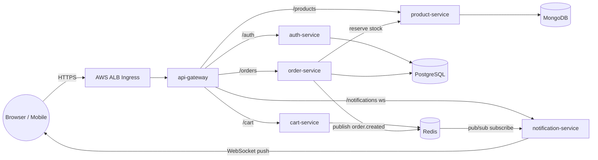

# E-Commerce Microservices Platform — DevOps / GitOps Reference Project

A complete, runnable e-commerce backend built as independent microservices, each
with its own purpose-fit database, wired together with a realtime notification
layer, containerized, and deployed to **Amazon EKS** using **ArgoCD (GitOps)**.

This repo is meant to be **cloned and actually deployed** so you can practice a
real production-style workflow end to end — not just read about one.

---

## Table of contents

1. [Architecture overview](#1-architecture-overview)
2. [Why each service exists, and why its database was chosen](#2-why-each-service-exists-and-why-its-database-was-chosen)
3. [Repository structure](#3-repository-structure)
4. [Run it locally with Docker Compose](#4-run-it-locally-with-docker-compose)
5. [How realtime works](#5-how-realtime-works)
6. [Kubernetes design (Kustomize)](#6-kubernetes-design-kustomize)
7. [Deploying to EKS, step by step](#7-deploying-to-eks-step-by-step)
8. [Installing ArgoCD and syncing the app-of-apps](#8-installing-argocd-and-syncing-the-app-of-apps)
9. [CI/CD pipeline — how a commit becomes a deployment](#9-cicd-pipeline--how-a-commit-becomes-a-deployment)
10. [Secrets management (and what NOT to do)](#10-secrets-management-and-what-not-to-do)
11. [Observability](#11-observability)
12. [Testing the deployed platform](#12-testing-the-deployed-platform)
13. [Troubleshooting](#13-troubleshooting)
14. [Tearing everything down](#14-tearing-everything-down)
15. [What's intentionally simplified](#15-whats-intentionally-simplified)

---

## 1. Architecture overview



**Request flow for "place an order" (this is the part that shows why the
pieces are separated the way they are):**

1. Browser calls `POST /orders` on **api-gateway**, the single public
   entry point (the only Service exposed via Ingress; everything else is
   `ClusterIP`-only, same as a real company's edge/internal split).
2. **api-gateway** proxies the request to **order-service**.
3. **order-service** calls **product-service** to atomically decrement
   stock (`findOneAndUpdate` with a `stock >= quantity` guard — this
   prevents overselling without needing a distributed lock).
4. **order-service** writes the order row to its own **PostgreSQL**
   database, then publishes an `order.created` event on a **Redis**
   pub/sub channel.
5. **notification-service**, subscribed to that channel, pushes a
   `notification` event over an already-open **WebSocket** to that
   specific user — this is the "realtime" part: the browser doesn't
   poll, it gets pushed to.

---

## 2. Why each service exists, and why its database was chosen

| Service | Responsibility | Database | Why this database |
|---|---|---|---|
| **api-gateway** | Single public entry point; reverse-proxies to internal services | none (stateless) | Nothing to persist — it only routes. Keeping it stateless means it can scale horizontally with zero coordination. |
| **auth-service** | Register/login, issues JWTs | **PostgreSQL** | User identity is relational and must be *correct*: unique emails, ACID transactions, no partial writes. A relational DB with constraints is the right tool when correctness beats flexibility. |
| **product-service** | Product catalog, stock | **MongoDB** | Product attributes vary hugely by category (clothing has size/color, electronics have RAM/CPU). A flexible document schema avoids a migration every time a new product type is added, and catalog data is read far more than it's written, which document stores handle well at scale. |
| **cart-service** | Shopping cart | **Redis** | A cart is short-lived, hit on almost every page view, and doesn't need relational integrity. Redis gives sub-millisecond reads/writes and native TTL, so an abandoned cart expires on its own — no cleanup job required. |
| **order-service** | Places orders, reserves stock, emits events | **PostgreSQL** | An order is a financial record. It needs durability, transactional writes, and to be queryable for refunds/audits/reporting — exactly what an RDBMS is built for. Redis is *also* used here, but only as a message bus (pub/sub), never as the system of record. |
| **notification-service** | Realtime push to the browser via WebSockets | none (Redis as transport only) | It holds no state of its own — it's a thin relay between the Redis pub/sub channel and open WebSocket connections. |

**The general principle demonstrated here:** pick the database per access
pattern, not one database for the whole system. This is why it's called
"polyglot persistence" and it's exactly how real e-commerce platforms
(Amazon, Shopify) are built — user/order data in relational stores, catalog
in a document store, cart/session in a cache.

---

## 3. Repository structure

```text
ecommerce-platform/
├── services/                  # One folder per microservice, each independently deployable
│   ├── api-gateway/
│   ├── auth-service/
│   ├── product-service/
│   ├── cart-service/
│   ├── order-service/
│   └── notification-service/
├── docker-compose.yml          # Full local stack: 6 services + 3 databases
├── infra/init-db.sh             # Creates authdb/orderdb inside the local Postgres container
├── k8s/
│   ├── base/                   # Plain Kustomize base — one folder per component
│   │   ├── namespace/
│   │   ├── postgres/  mongodb/  redis/       (StatefulSet + PVC + headless Service)
│   │   ├── auth-service/ product-service/ ... (Deployment + Service + ConfigMap + HPA)
│   │   └── ingress/             # AWS ALB Ingress -> api-gateway
│   └── overlays/
│       ├── dev/                 # 1 replica, :dev image tags
│       └── prod/                # 3 replicas, pinned :vX.Y.Z image tags
├── argocd/
│   ├── project.yaml             # AppProject scoping what this repo is allowed to touch
│   ├── app-of-apps.yaml         # The ONE Application you create by hand
│   └── apps/                    # ArgoCD auto-discovers every file here as its own Application
└── .github/workflows/ci-cd.yaml # Build, test, push image, bump Git tag (GitOps trigger)
```

---

## 4. Run it locally with Docker Compose

This is the fastest way to see the whole system working before touching
Kubernetes at all.

```bash
git clone <this-repo-url> ecommerce-platform
cd ecommerce-platform
cp .env.example .env

docker compose up --build
```

This starts, in order of dependency: `postgres`, `mongodb`, `redis`, then all
six application services, then `api-gateway` on **http://localhost:4000**.

Try it end to end:

```bash
# 1. Register a user
curl -X POST http://localhost:4000/auth/register \
  -H "Content-Type: application/json" \
  -d '{"email":"demo@example.com","password":"pass1234"}'

# 2. Log in, grab the JWT
curl -X POST http://localhost:4000/auth/login \
  -H "Content-Type: application/json" \
  -d '{"email":"demo@example.com","password":"pass1234"}'

# 3. Create a product
curl -X POST http://localhost:4000/products \
  -H "Content-Type: application/json" \
  -d '{"name":"Wireless Mouse","price":19.99,"stock":50,"category":"electronics"}'
# copy the returned "_id"

# 4. Place an order (this triggers the realtime notification)
curl -X POST http://localhost:4000/orders \
  -H "Content-Type: application/json" \
  -d '{"userId":"1","productId":"<paste _id here>","quantity":2}'
```

Open `docs/realtime-test.html` in a browser (or any Socket.IO client) pointed
at `http://localhost:4005` with `socket.emit('join', '1')` before placing the
order, and watch the `notification` event arrive live.

---

## 5. How realtime works

Realtime here means **server-push over WebSockets**, not polling:

- **notification-service** runs a Socket.IO server. Each browser tab
  connects and calls `join(userId)`, which puts that socket into a
  room named `user:<id>`.
- **order-service** never talks to sockets directly — it just publishes a
  small JSON message to a Redis pub/sub channel (`order-events`) the moment
  an order is persisted.
- **notification-service** subscribes to that channel and re-emits the
  event only to the room for the affected user.

This decouples "something happened" from "tell the browser" — any future
service (shipping-service, payment-service, etc.) can publish to the same
channel without ever knowing notification-service or Socket.IO exist.

---

## 6. Kubernetes design (Kustomize)

Every component under `k8s/base/` is a **self-contained Kustomize package**
(its own `kustomization.yaml`), which is what lets ArgoCD manage each one as
an independent Application — deploy or roll back `product-service` without
touching anything else.

- **Databases** (`postgres`, `mongodb`, `redis`) are `StatefulSet`s with a
  `PersistentVolumeClaim` each (`storageClassName: gp3`, EKS's default EBS
  CSI storage class) and a **headless Service** (`clusterIP: None`) so each
  gets a stable DNS name.
- **App services** are `Deployment`s (stateless, horizontally scalable) with
  a `ConfigMap` for non-secret config, a `Service` (ClusterIP), and an
  `HorizontalPodAutoscaler` targeting 70% CPU.
- **Secrets** (`postgres-secret`, `auth-service-secret`) ship with obvious
  placeholder values — see [section 10](#10-secrets-management-and-what-not-to-do)
  for how a real company replaces them before this ever reaches production.
- `k8s/overlays/dev` and `k8s/overlays/prod` sit on top of `base/` and only
  change replica counts and image tags — the same manifests, promoted
  between environments, which is the point of Kustomize overlays.

---

## 7. Deploying to EKS, step by step

### 7.1 Prerequisites

```bash
aws --version          # AWS CLI v2
eksctl version
kubectl version --client
helm version
argocd version --client
```

You'll also need an AWS account with permission to create an EKS cluster,
and a container registry to push images to (examples below use GitHub
Container Registry, `ghcr.io` — swap for ECR if you prefer).

### 7.2 Create the EKS cluster

```bash
eksctl create cluster \
  --name ecommerce-cluster \
  --region us-east-1 \
  --nodegroup-name standard-workers \
  --node-type t3.medium \
  --nodes 3 \
  --nodes-min 2 \
  --nodes-max 5 \
  --managed
```

This takes ~15 minutes. `eksctl` also updates your local `~/.kube/config`
so `kubectl` immediately points at the new cluster.

```bash
kubectl get nodes     # confirm 3 nodes are Ready
```

### 7.3 Install the EBS CSI driver (needed for the databases' PVCs)

```bash
eksctl create addon --cluster ecommerce-cluster --name aws-ebs-csi-driver \
  --service-account-role-arn <IRSA-role-arn-with-ebs-permissions>
```

(See the [AWS EBS CSI driver docs](https://docs.aws.amazon.com/eks/latest/userguide/ebs-csi.html)
for the IRSA role's IAM policy — `AmazonEBSCSIDriverPolicy` covers it.)

### 7.4 Install the AWS Load Balancer Controller (for the Ingress)

```bash
helm repo add eks https://aws.github.io/eks-charts
helm repo update
helm install aws-load-balancer-controller eks/aws-load-balancer-controller \
  -n kube-system \
  --set clusterName=ecommerce-cluster \
  --set serviceAccount.create=true \
  --set serviceAccount.name=aws-load-balancer-controller
```

This is what turns the `Ingress` in `k8s/base/ingress/` into an actual
internet-facing Application Load Balancer.

---

## 8. Installing ArgoCD and syncing the app-of-apps

```bash
kubectl create namespace argocd
kubectl apply -n argocd -f https://raw.githubusercontent.com/argoproj/argo-cd/stable/manifests/install.yaml

# wait for pods to be ready
kubectl -n argocd get pods -w
```

Get the initial admin password and log in:

```bash
kubectl -n argocd get secret argocd-initial-admin-secret \
  -o jsonpath="{.data.password}" | base64 -d; echo

kubectl -n argocd port-forward svc/argocd-server 8080:443
argocd login localhost:8080 --username admin --password <password-above>
```

Now point ArgoCD at this repo and apply the **app-of-apps** — this single
Application is the only thing you create manually; it in turn creates one
Application per microservice/database found in `argocd/apps/`:

```bash
kubectl apply -f argocd/project.yaml
kubectl apply -f argocd/app-of-apps.yaml
```

Watch it fan out and sync:

```bash
argocd app list
argocd app get ecommerce-app-of-apps
```

You should see `namespace`, `postgres`, `mongodb`, `redis`,
`auth-service`, `product-service`, `cart-service`, `order-service`,
`notification-service`, `api-gateway`, and `ingress` all appear as separate
Applications and go `Healthy` / `Synced`. Each carries an
`argocd.argoproj.io/sync-wave` annotation so ArgoCD deploys the namespace
first, then the databases, then the app services, then the Ingress — the
app services would otherwise crash-loop trying to reach a database that
doesn't exist yet.

Get the public URL:

```bash
kubectl -n ecommerce get ingress ecommerce-ingress
# use the ADDRESS column (the ALB's DNS name) as your base URL
```

From here on, **you never run `kubectl apply` again.** Every change goes
through Git — see the next section.

---

## 9. CI/CD pipeline — how a commit becomes a deployment

`.github/workflows/ci-cd.yaml` runs on every push to `services/**`:

1. Detects which service(s) changed (so a `product-service` edit doesn't
   rebuild all six images).
2. Runs that service's tests.
3. Builds and pushes a Docker image, tagged both `:<git-sha>` and `:dev`.
4. Uses `kustomize edit set image` to bump `k8s/overlays/dev/kustomization.yaml`
   to the new SHA, and commits that change back to the repo.

**ArgoCD is watching that same repo.** Within its polling interval (default
3 minutes, or instantly via a webhook) it notices the manifest changed,
diffs it against the live cluster state, and applies it — `selfHeal: true`
means it will also revert any manual `kubectl edit` someone does directly
on the cluster, back to what's declared in Git.

This is the whole point of GitOps: **CI never has cluster credentials.**
The pipeline can be fully compromised and the worst it can do is push a bad
image tag to Git — it cannot directly touch the cluster. Only ArgoCD, running
inside the cluster with its own service account, has that access.

---

## 10. Secrets management (and what NOT to do)

The `Secret` manifests committed here (`postgres-secret`,
`auth-service-secret`) contain obvious placeholder values on purpose, so the
project runs out of the box. **Never commit real secrets to Git — even
inside a private repo.** Before using this in anything real:

- Use the **[External Secrets Operator](https://external-secrets.io/)** to
  sync values from **AWS Secrets Manager** into Kubernetes `Secret` objects
  at deploy time — the repo then only contains an `ExternalSecret` pointer,
  never the value.
- Or use **[Sealed Secrets](https://github.com/bitnami-labs/sealed-secrets)**,
  which lets you commit an *encrypted* secret that only the cluster's
  controller can decrypt.
- Grant pods access via **IRSA** (IAM Roles for Service Accounts) instead of
  static AWS keys wherever a service needs to call an AWS API.

---

## 11. Observability

Every service exposes:
- `GET /health` — used by Kubernetes readiness/liveness probes.
- `GET /metrics` — Prometheus-format metrics via `prom-client`.

To scrape them in-cluster, install `kube-prometheus-stack`:

```bash
helm install monitoring prometheus-community/kube-prometheus-stack -n monitoring --create-namespace
```

and add a `ServiceMonitor` per service (not included here to keep the base
manifests focused — add one under `k8s/base/<service>/servicemonitor.yaml`
following the chart's CRD once installed).

---

## 12. Testing the deployed platform

```bash
BASE_URL=http://<your-alb-dns-name>

curl -X POST $BASE_URL/auth/register -H "Content-Type: application/json" \
  -d '{"email":"test@example.com","password":"pass1234"}'

curl -X POST $BASE_URL/auth/login -H "Content-Type: application/json" \
  -d '{"email":"test@example.com","password":"pass1234"}'

curl $BASE_URL/products
```

---

## 13. Troubleshooting

| Symptom | Likely cause | Fix |
|---|---|---|
| `auth-service` / `order-service` CrashLoopBackOff | Started before Postgres was ready | Check sync-wave ordering: `kubectl -n ecommerce get pods -l app=postgres` should be `Running` first. ArgoCD's `retry` block will keep retrying. |
| ArgoCD app stuck `OutOfSync` after a manual `kubectl edit` | `selfHeal` reverted it | Expected behavior — make the change in Git instead. |
| PVC stuck `Pending` | EBS CSI driver not installed | Re-run step 7.3, confirm `kubectl get sc` shows `gp3`. |
| Ingress has no `ADDRESS` | AWS Load Balancer Controller not running | `kubectl -n kube-system get pods -l app.kubernetes.io/name=aws-load-balancer-controller` |
| WebSocket notification never arrives | Client didn't emit `join(userId)` before the order was placed, or `userId` mismatch | The room name is `user:<userId>` — it must exactly match the `userId` sent to `/orders`. |

---

## 14. Tearing everything down

```bash
kubectl delete -f argocd/app-of-apps.yaml   # cascades to every child Application
eksctl delete cluster --name ecommerce-cluster --region us-east-1
```

---

## 15. What's intentionally simplified

This is a learning/practice reference, not a production system as-is. Known
simplifications, called out honestly:

- No API-level rate limiting or WAF on the Ingress.
- No distributed tracing (would add OpenTelemetry + Jaeger in a next step).
- Order/product consistency uses a simple synchronous HTTP call + reserve
  endpoint rather than a saga/outbox pattern — fine at small scale, worth
  revisiting (e.g. transactional outbox + Kafka) at real production volume.
- Single-replica StatefulSets for the databases — a real deployment would use
  managed services (RDS, DocumentDB/Atlas, ElastiCache) or a proper HA
  operator (e.g. Zalando's postgres-operator) instead of a bare StatefulSet.
- Placeholder Secrets, as covered in section 10.

